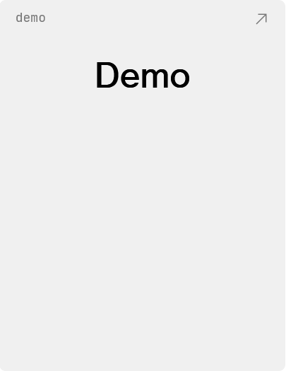
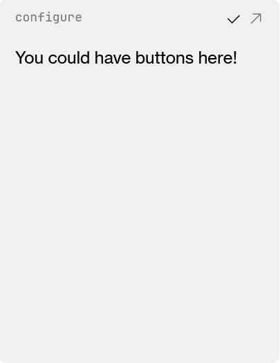
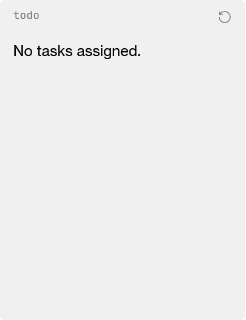

# The Widget Component
{: .no_toc }
#### TABLE OF CONTENTS
{: .no_toc }
1. 
{: toc }

## Mandatory Elements
There are a few properties that are mandatory for any widget.

These are **the title, UID, and content.**

First, any widget must have a title. The "title" is the user-facing name for the widget. It may be different from a development name. For example, while the widget that shows an image is called the `ImageWidget` in code, its title is "moment", and this is what the user sees.

Next, all widgets must have a UID, or *unique identifier*. This a property always provided to components that create then import and use the `Widget` component, and therefore is always simply passed through to the `Widget` rather than assigned by any user creating a widget.

For example, in this code snippet, the `UID` is simply passed through, as is always the case.

```svelte
<script lang="ts">
    import Widget from "$lib/Widgets/Widget.svelte";
    let { UID } = $props();
</script>

<Widget {UID} title="memo">
    // Your widget content will go here.
</Widget>
```

{: .info }
The UID is exposed to the file implementing the `Widget` component because it can be used for varying applications per widget. For example, in [Data Management](./data-management) you will use the UID to differentiate which widget data should be attached to.

Finally, all widgets must have some amount of content. This requirement should be easy to satisfy; you weren't planning to make a blank, useless widget, were you?

Content refers to what's between the openning and closing tags of the `Widget` tag. For example, the following throws an error:

```svelte
// Script up here

<Widget {UID} title="demo"></Widget>
```

But if you put any HTML tag inside the `Widget` tags, the error will resolve.

## Widget Size

By default, widgets can be sized to three sizes: small, medium, and large. Currently, you can set a minimum and maximum size within that range. 

The minimum size is set with the `min` property, and the maximum size with the `max` property. These should be set to one of the values in the `WidgetSize` enum, which can be imported from `Widget.svelte`.

For example, the following widget can be sized to all three sizes. (this is the default, setting your widget with these is redundant)

```svelte
// Script up here

<Widget {UID} title="demo" min={WidgetSize.SMALL} max={WidgetSize.LARGE}>
    // Content here
</Widget>
```

This widget can only be sized small or medium.

```svelte
// Script up here

<Widget {UID} title="demo" max={WidgetSize.MEDIUM}>
    // Content here
</Widget>
```

And this widget only large.

```svelte
// Script up here

<Widget {UID} title="demo" min={WidgetSize.LARGE}>
    // Content here
</Widget>
```

## External URL

You can supply an external URL to the `Widget` component via the `openURL` property. The link supplied will show on the widget as a button the user can click to open it in a new tab.

For example,

```svelte
// Script up here

<Widget {UID} title="search" openURL="https://www.google.com/">
    // Content here
</Widget>
```

creates a widget like so



where the button in the top-right opens to https://www.google.com.

## The Edit Menu

Oftentimes your widget will have settings associated with it that can be configured. To hide these settings away when they're not needed, we have the `editMenu` property.

This property is special in that it is not passed in with the `Widget` tag. Rather, we pass this property by creating a *snippet* in the body of the tags.

The `editMenu` snippet looks like the following:

```svelte
// Script up here

<Widget {UID} title="demo">
    // Regular content here
    {#snippet editMenu()}
        // Edit menu content here
        <p>You could have buttons here!</p>
    {/snippet}
</Widget>
```

The above creates a widget with the following edit menu, which is displayed after clicking on the edit icon (the pencil).



## Custom Buttons

Sometimes you want to add custom buttons to your widget. For example, some widgets with integrations include buttons that allow users to refresh those integrations.

We use another snippet property to do this. This time, the snippet is called `buttons`.

For example, in our `todo` widget, we include a *refresh button* to allows users to refresh assignments.

```svelte
// Script and styles up here

<Widget {UID} title="todo">
    // Content here

    {#snippet buttons()}
        <RefreshButton action={refreshAssignments} alt="Refresh tasks" />
    {/snippet}
</Widget>
```

The above creates a button like so:

