# Walkthrough: Creating a Widget
{: .no_toc }

This article will walk you through creating an example widget, from start to finish.

Our finished widget will include:
1. 
{: toc }

### *Content that changes based on its two available widget sizes, small and medium.*

We begin by creating our new component file. We're going to create the "UW" widget, so we'll name it `UWWidget.svelte`. Inside of our new file, we'll import and create our `Widget` tag.

```svelte
<script lang="ts">
    import Widget from '$lib/Widgets/Widget.svelte';
</script>

<Widget>
    
</Widget>
```

Then, we need to remember to pass in our UID and title.

```svelte
<script lang="ts">
    import Widget from '$lib/Widgets/Widget.svelte';
    let { UID } = $props();
</script>

<Widget {UID} title="uw">

</Widget>
```

Now, this widget has two sizes: small and medium. We're going to change our content depending on what size the user is showing. We'll also make sure to use the `max` property to restrict its sizes.

```svelte
<script lang="ts">
    import Widget, { WidgetSize } from '$lib/Widgets/Widget.svelte';
	import { getWidget } from './Widgets.svelte';
    let { UID } = $props();
</script>

<Widget {UID} title="uw" max={WidgetSize.LARGE}>
    {#if getWidget(UID).w == 1}
        // Small
    {:else}
        // Large
    {/if}
</Widget>
```

Next, we'll add in all our content and styling.

```svelte
<script lang="ts">
    import Widget, { WidgetSize } from '$lib/Widgets/Widget.svelte';
	import { getWidget } from './Widgets.svelte';
    let { UID } = $props();

    let date = new Date();
    let quarter = Math.floor((date.getMonth() + 3) / 3);
    let quarterText = ["Winter", "Spring", "Summer", "Fall"][quarter - 1];
    let quarterTextFull = `${quarterText} ${date.getFullYear()}`;

</script>

<style>
    .uw-container-small {
        display: flex;
        flex-direction: column;
        align-items: center;
        height: 100%;
        max-width: 100%;
        position: relative;
        overflow: hidden;
        border-radius: 6px;
    }

    .uw-container-medium {
        display: flex;
        height: 100%;
        max-width: 100%;
        border-radius: 6px;
        position: relative;
        overflow: hidden;
    }

    .text-elements {
        display: flex;
        flex-direction: column;
        justify-content: center;
        align-items: center;
        position: absolute;
        right: 0;
        padding: 10px;
        padding-right: 10%;
        top: 50%;
        transform: translateY(-50%);
        background: var(--widget-color);
        border-radius: 6px;
    }

    .uw-logo {
        max-width: 50px;
        margin: 10px;
    }

    .quarter-text {
        font-size: 30px;
        margin: 0;
    }

    .cherry-blossoms {
        position: absolute;
        bottom: 0;
        height: 100%;
        left: 50%;
        transform: translateX(-50%);
        mask-image: linear-gradient(to bottom, transparent, black);
    }

    .cherry-blossoms-medium {
        position: absolute;
        height: 100%;
        mask-image: linear-gradient(to left, transparent, black);
    }
</style>

<Widget {UID} title="uw" max={WidgetSize.MEDIUM}>
    {#if getWidget(UID).w == 1}
        <div class="uw-container-small">
            
            <p class="quarter-text">{quarterTextFull}</p>
            
        </div>
    {:else}
        <div class="uw-container-medium">
            
            <div class="text-elements">
                
                <p class="quarter-text">{quarterTextFull}</p>
            </div>
        </div>
    {/if}
</Widget>
```

And with this we end up with a nice result!

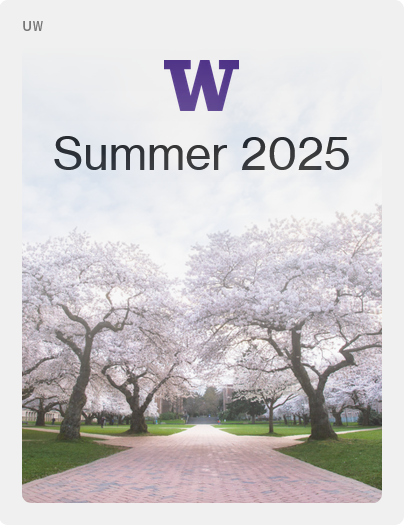
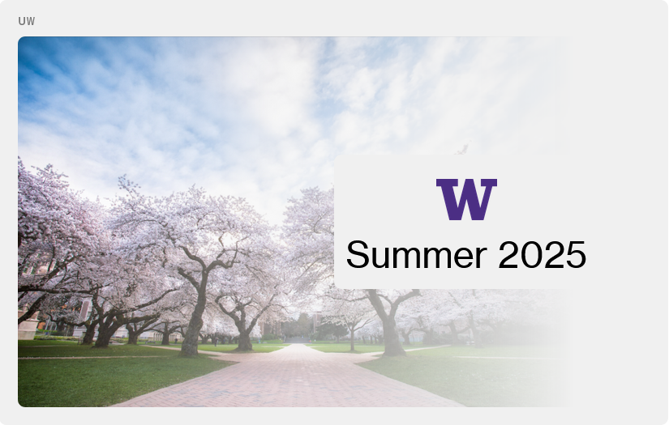

As you can see, the content is different for the two sizes. Neat!

### *An external link accessible via button in header*

Next, let's add an external link to the UW website. This is as simple as adding `openURL` to the widget tag.

```svelte
// Script and styling up here
<Widget {UID} title="uw" max={WidgetSize.MEDIUM} openURL="https://www.washington.edu/">
    // Content here
</Widget>
```

Now we have a button that opens the UW website!


### *Settings configurable by the user that save across sessions*

What if our user gets bored of seeing the cherry blossoms everyday? Let's make it so they can change that image!

But hold on - we don't want our users to put just any image in there. What if they put a picture of a cougar (*shivers*)? We can't have that! We'll curate a few images and let them choose between them.

Let's start by defining the images we'll let our user use.

```svelte
<script>
    // Other script code

    let possibleImages = {
        "Cherry Blossoms": "https://...",
        "Suzzallo": "https://...",
        "Drumheller Fountain": "https://..."
    };

    let currentImage = $state("Cherry Blossoms");

</script>
```

We also created a stateful variable to indicate which image is currently selected.

Next we'll updated our image tags to use this new system...

```svelte
<Widget {UID} title="uw" max={WidgetSize.MEDIUM} openURL="https://www.washington.edu/">
    {#if getWidget(UID).w == 1}
        <div class="uw-container-small">
            ...
            
        </div>
    {:else}
        <div class="uw-container-medium">
            
            ...
            </div>
        </div>
    {/if}
</Widget>
```

If we build now, we see the exact same result as before. Great! But now let's let the user actually configure the image. We'll do that in the edit menu.

```svelte
<Widget {UID} title="uw" max={WidgetSize.MEDIUM} openURL="https://www.washington.edu/">
    ...
    {#snippet editMenu()}
        <label for="image-select">background image</label>
        <select name="image" id="image-select" bind:value={currentImage}>
            {#each Object.keys(possibleImages) as image}
                <option value={image}>{image}</option>
            {/each}
        </select>
    {/snippet}
</Widget>
```

Now we see all our options in the edit menu, and when we cick on them, our image changes!

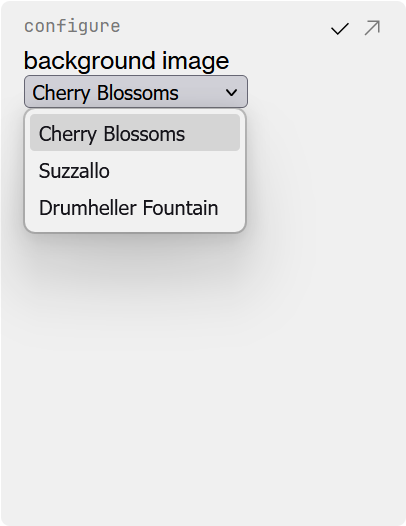
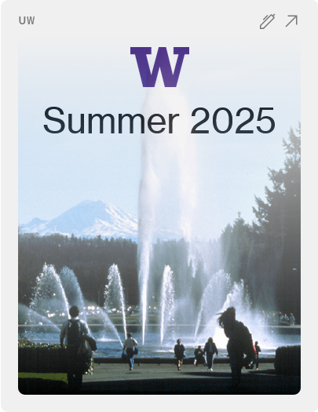

But there's a problem: when we open a new tab, the image just reverts back to the fountain.

This is because while we did make our variable stateful within the active tab, which means that it responds and updates the DOM when updates occur, we do not save our new value anywhere. Therefore, when we open a new tab, we end up with just the default values for our unsaved variables, so we see the cherry blossoms.

To fix this, we need to make our `currentImage` variable both stateful and savable.

Currently, we do this with `initWidgetData`. We collect all our widget's data into a single object, and then access and modify it with that data.

For our exmaple, our data object will just have one key: our current image, but other widgets may use many more keys.

```svelte
<script lang="ts">
    // Other script code

    const data = initWidgetData(UID, {
        currentImage: "Cherry Blossoms"
    }).stateful;

</script>

<Widget {UID} title="uw" max={WidgetSize.MEDIUM} openURL="https://www.washington.edu/">
    {#if getWidget(UID).w == 1}
        <div class="uw-container-small">
            ...
            
        </div>
    {:else}
        <div class="uw-container-medium">
            
            ...
        </div>
    {/if}

    {#snippet editMenu()}
        ...
        <select name="image" id="image-select" bind:value={data.currentImage}>
            ...
        </select>
    {/snippet}
</Widget>
```

Note that after calling `initWidgetData`, we access our new data object by its `stateful` key.

Now when we open a new tab, our configured image is remembered, loaded, and displayed to the user! Even if we close out and reopen our browser, the configured image is saved.

### *A custom button*

What's the best remedy for a bad mood? Dubs, of course! Let's add a new button for when people need a dose of Dubs in their day.

For the most seamless look, we'll implement this button in the header of our widget with all the other buttons.

When we click our custom button, we want Dubs to fly up for a moment to greet everyone.

Let's start by adding Dubs.

```svelte
<style>
    ...
    .dubs {
        position: absolute;
        z-index: 5;
        width: 300px;
        transform: translateX(-50%);
        clip-path: polygon(/*path to remove background*/);
    }
</style>

<Widget {UID} title="uw" max={WidgetSize.MEDIUM} openURL="https://www.washington.edu/">
    {#if getWidget(UID).w == 1}
        ...
    {:else}
        ...
    {/if}
     
    ...
</Widget>
```

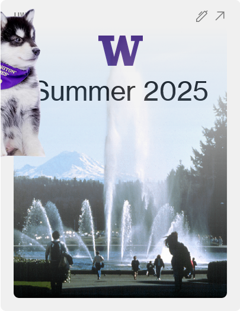

Next we'll add an animation where dubs flying up.

```svelte
<style>
    ...
    .dubs {
        /*...*/
        left: 40%;
        bottom: -100%;
        /*...*/
        animation: dubsUp 5s ease-in-out infinite;
    }

    @keyframes dubsUp {
        0% {
            rotate: -20deg;
            left: 40%;
            bottom: -100%;
        }
        50% {
            bottom: 100px;
            rotate: 5deg;
        }
        100% {
            bottom: -100%;
            rotate: -20deg;
            left: 60%;
        }
    }

</style>
```

And now Dubs flys up.

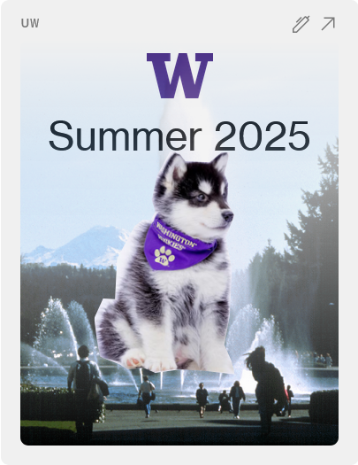

But Dubs is constantly flying up! We need to add our button that allows the user to trigger the animation.

```svelte
<script lang="ts">
    ...
    let animateDubs = $state(false);
    
</script>

<style>
    /*...*/
    .animateDubs {
        animation: dubsUp 5s ease-in-out forwards;
    }

    button {
        background: none;
        border: none;
        cursor: pointer;
        padding: 0;
        margin: 0;
    }
    /*...*/
</style>

<Widget {UID} title="uw" max={WidgetSize.MEDIUM} openURL="https://www.washington.edu/">
    ...
     
    ...
    {#snippet buttons()}
        <button onclick={() => {
            animateDubs = true;
            setTimeout(() => {
                animateDubs = false;
            }, 5000);
        }} aria-label="Animate Dubs">
            
        </button>
    {/snippet}
</Widget>
```

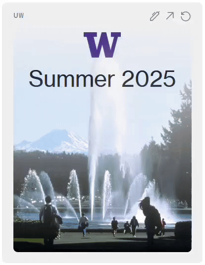

Some widgets may need to add multiple buttons. The buttons snippet absolutely allows this; just add more button tags!

### *Previews and skeletons*

Our widget is looking pretty good! However, there are a few features that are still missing. First, our widget's preview in the picker is missing! Also, when we go to arrange, we don't see a skeleton.

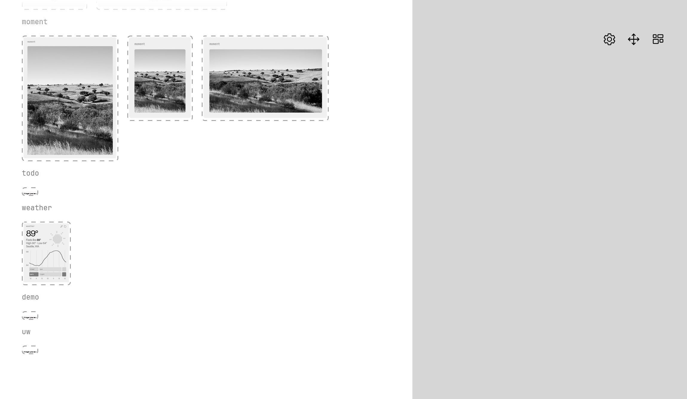
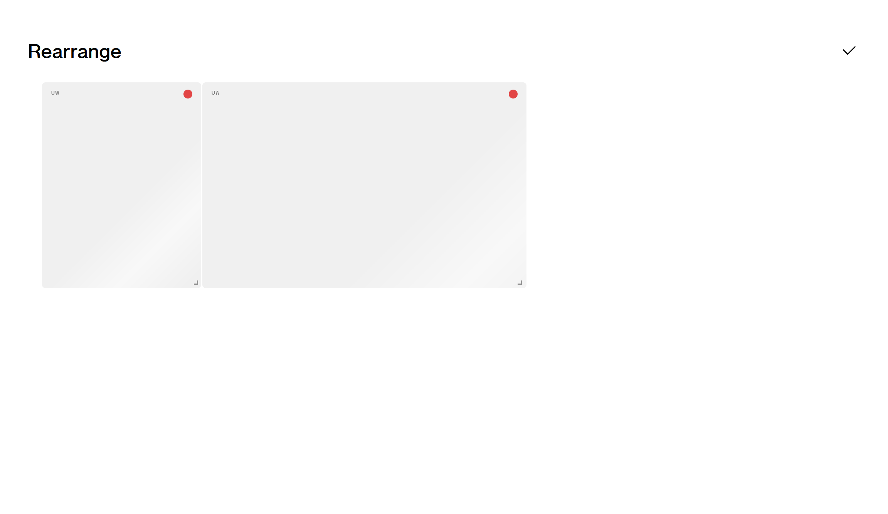

That's because we have to add those!

We'll start with the preview. First, we need to get our widget in a presentable state for both its sizes: small and medium.

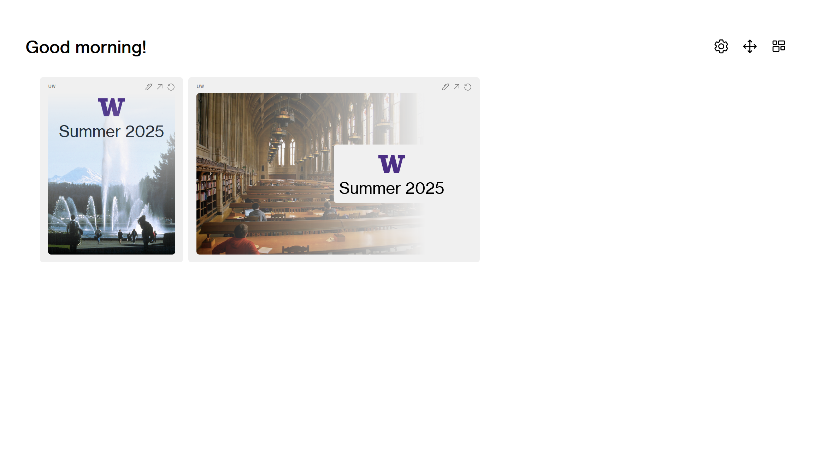

Then, we open inspect element and screenshot the `Card` nodes for each of our widgets.

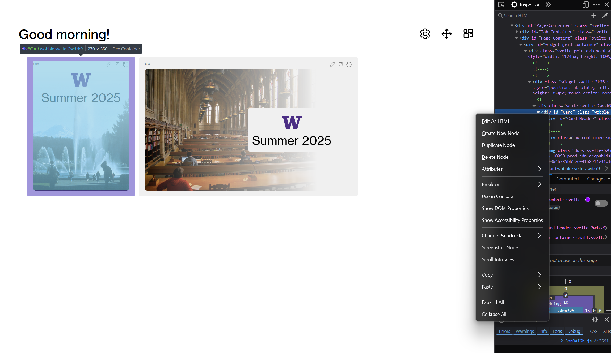

We rename the screenshot of the small size widget `uw-small.png` and the medium one `uw-medium.png`. Then we drop those into our `widget-previews` folder.

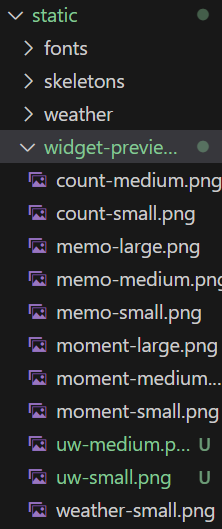

Now, if we build our project again and go to the widget picker, we now see previews of our widget!

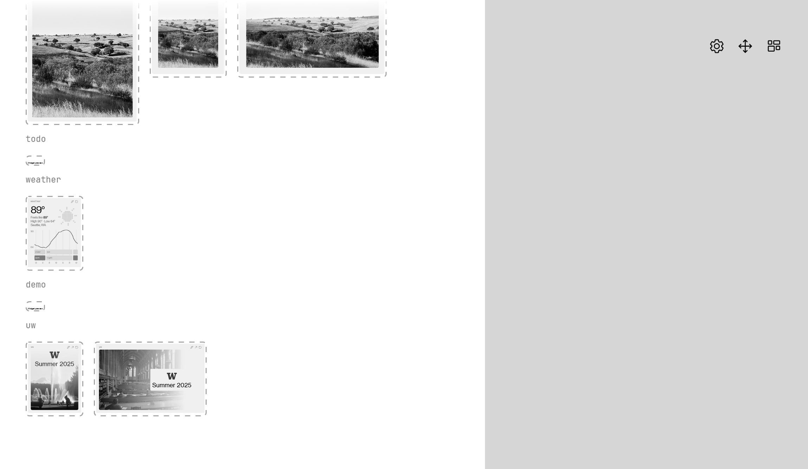

Okay, now that we have our widget preview, let's create the skeletons.

We're going to take both the preview images we captured and import them into Figma.


Then we simply block out the important information.

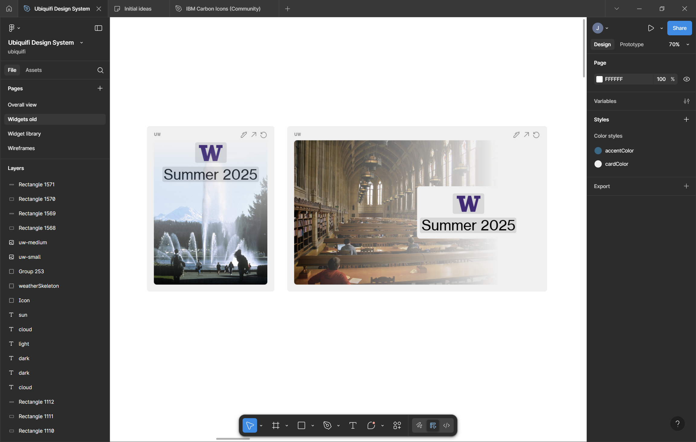

Now, we group the skeleton blocks with the image we imported for each widget, then hide the imported image and export each group as an `svg` into our `skeletons` folder.

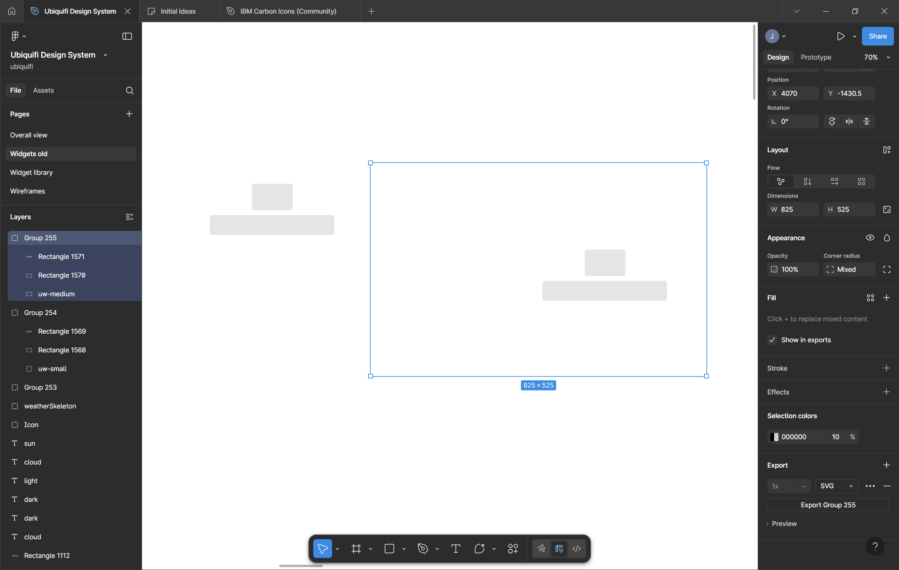

{: .info }
**Why do we group the imported image just to hide it right after?** <br>
By grouping the imported image with the skeleton rectangles we create, the exported svg encodes the positions of those rectangles relative to the entire widget size. If we didn't group the skeleton rectangles with the imported image, the exported svg's dimensions would be super small and it wouldn't align with the widget correctly.

Next, we need to slightly modify our svg files in a text editor. We'll first add an id to the outer-most svg tag, and then we'll make our skeletons compliant with our themes by replacing the `black` color used with `var(--color)`.

For `uw-small.svg`, it goes from

```
<svg width="405" height="526" viewBox="0 0 405 526" fill="none" xmlns="http://www.w3.org/2000/svg">
<rect x="154" y="52" width="100" height="65" rx="6" fill="black" fill-opacity="0.1"/>
<rect x="50" y="129" width="306" height="49" rx="6" fill="black" fill-opacity="0.1"/>
</svg>
```

to

```
<svg width="405" height="526" viewBox="0 0 405 526" fill="none" xmlns="http://www.w3.org/2000/svg" id="skeleton">
<rect x="154" y="52" width="100" height="65" rx="6" fill="var(--color)" fill-opacity="0.1"/>
<rect x="50" y="129" width="306" height="49" rx="6" fill="var(--color)" fill-opacity="0.1"/>
</svg>
```

We repeat similarly for `uw-medium.svg`.

Now when we build, we see we have a skeleton appear for our UW widget when we go to arrange it! And it react to our themes.

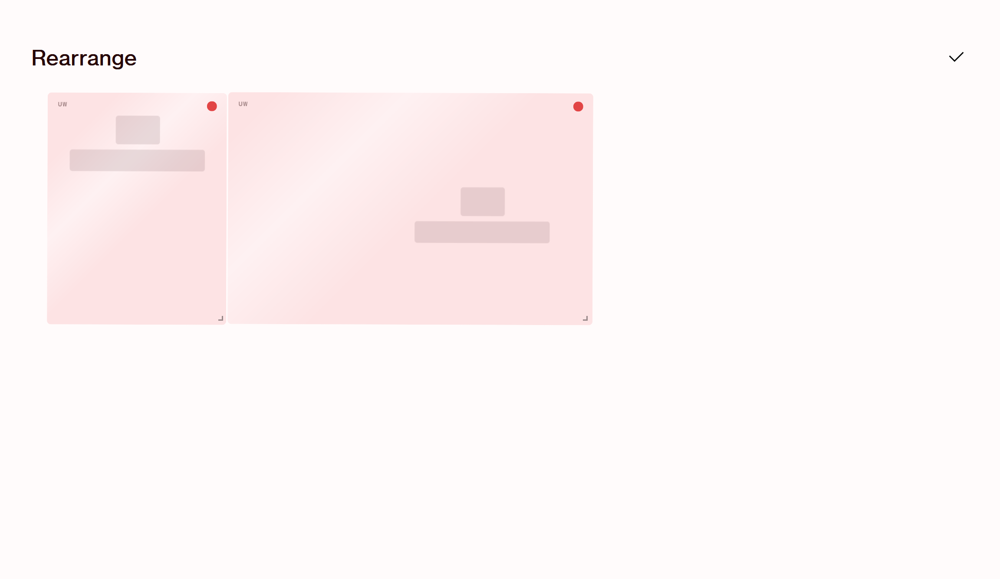

And just like that, we've created a complete widget!

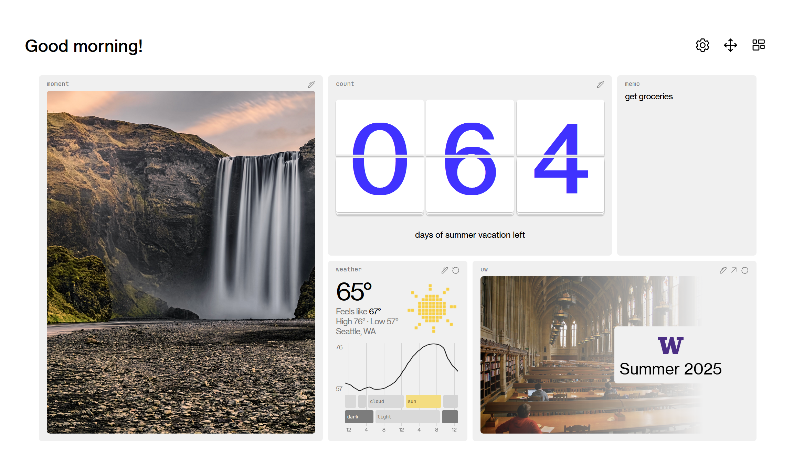